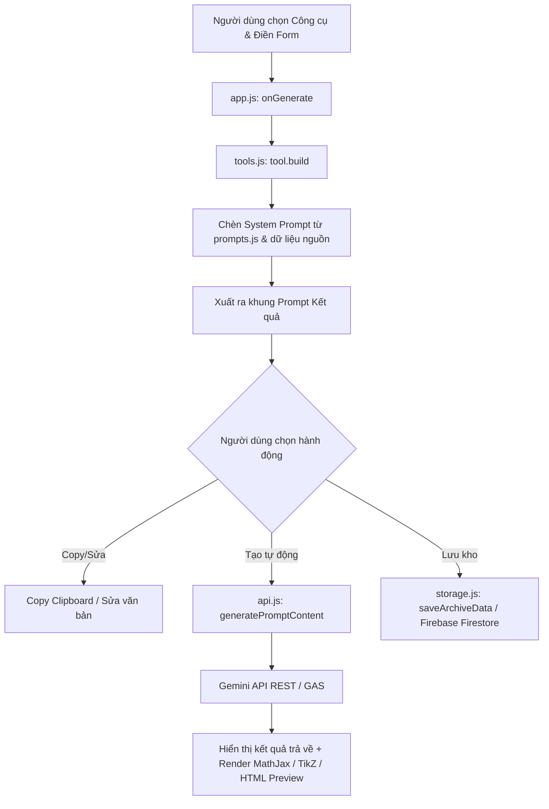

# HỆ THỐNG KIẾN TRÚC & MẠCH DỮ LIỆU - APP PROMPT (CHUYỂN ĐỔI SỐ)

Document ghi nhớ kiến trúc hệ thống phục vụ nâng cấp và hoàn thiện ứng dụng trong tương lai.

---

## 1. Tổng Quan Ứng Dụng
- **Tên ứng dụng**: CHUYỂN ĐỔI SỐ - THẦY HÙNG TBS / Math_DTH (v5.0 MỚI)
- **Mục tiêu**: Trợ lý AI giáo dục chuyên sâu hỗ trợ giáo viên biên soạn prompt, kịch bản video (Veo 3), đề thi 22 câu, phiếu học tập, sơ đồ tư duy, script GeoGebra, TikZ, game Quiz HTML, dạy học song ngữ CLIL, và OCR tài liệu toán.
- **Công nghệ cốt lõi**:
  - **HTML5 & Vanilla CSS**: Thiết kế giao diện hiện đại với 4 Themes, Responsive Sidebar, Glassmorphism, Sheet Paper Layout.
  - **Modular JavaScript (ES6)**: Phân tách module sạch sẽ, dễ bảo trì và mở rộng.
  - **Tích hợp API & Thư viện**:
    - **Google Gemini API**: Direct REST Fetch (`generativelanguage.googleapis.com`) + Google Apps Script Bridge (`google.script.run`).
    - **MathJax v3**: Render công thức Toán LaTeX (`$inline$` & `$$display$$`).
    - **pdf.js & Mammoth.js**: Trích xuất dữ liệu từ file PDF và Docx.
    - **Firebase JS SDK (Compat v10)**: Auth vô danh, Firestore lưu kho tài liệu cloud (`shared_archives`, `shared_sources`, `shared_saved_links`, `comments`, `app_stats`).

---

## 2. Cấu Trúc Thư Mục & Phân Chia Module

```
APP PROMPT/
├── Index.html           # HTML cấu trúc ứng dụng & thứ tự nạp module scripts
├── css/
│   └── styles.css       # Design tokens, CSS Variables cho 4 Themes, layout & components
├── js/
│   ├── config.js        # Khai báo hằng số môn/lớp, themes, biến trạng thái toàn cục & Firebase config
│   ├── storage.js       # Quản lý LocalStorage, Firebase Cloud Sync (Archives, Sources, QuickLinks, Stats)
│   ├── api.js           # Xử lý gọi Gemini API trực tiếp & Apps Script bridge
│   ├── prompts.js       # Bộ Prompt hệ thống (SYS_VEO3, SYS_GEOGEBRA, SYS_DETHI22, SYS_TIKZ_EXPERT...)
│   ├── tools.js         # Định nghĩa 16+ công cụ (TOOLS), cấu hình Form Fields & hàm build Prompt
│   └── app.js           # Controller điều khiển chính: Render Form, Tabs, Gen Prompt, Render TikZ/AI, Modals
```

---

## 3. Thứ Tự Nạp Script Chuẩn Dựa Trên Phụ Thuộc (Dependency Chain)

Trong `Index.html`, thứ tự nạp file JavaScript là **bắt buộc** để tránh lỗi biến chưa định nghĩa:

1. `js/config.js` -> Định nghĩa các biến trạng thái & hằng số toàn cục (`MON_OPTIONS`, `LOP_OPTIONS`, `THEMES`, `fbDb`, `defaultFirebaseConfig`...).
2. `js/storage.js` -> Định nghĩa hàm xử lý dữ liệu LocalStorage/Firebase (`getLocalApiKey`, `saveArchiveData`, `initFirebaseSystem`...).
3. `js/api.js` -> Định nghĩa hàm kết nối Gemini API (`callGeminiDirectly`, `generatePromptContent`).
4. `js/prompts.js` -> Định nghĩa các Prompt hệ thống (`SYS_VEO3`, `SYS_PHIEUHOCTAP`, `SYS_GEOGEBRA`...).
5. `js/tools.js` -> Định nghĩa mảng `TOOLS` và `GUIDES` (sử dụng các `SYS_*` từ `prompts.js`).
6. `js/app.js` -> Khởi tạo giao diện, sự kiện click, render form, khởi chạy `applyTheme()`, `selectTool()`, `initFirebaseSystem()`.

---

## 4. Luồng Xử Lý Dữ Liệu Chính (Data Flow)



---

## 5. Danh Sách Công Cụ Đã Thiết Kế (16 Tools)

1. **`video-veo3`**: Video khởi động Veo 3
2. **`phieu-hoc-tap`**: Tạo phiếu học tập
3. **`mindmap`**: Sơ đồ tư duy / Infographic
4. **`geogebra`**: Script GeoGebra 2D/3D
5. **`de-22-cau`**: Đề kiểm tra chuẩn Công văn 7991 (22 câu / Linh hoạt cấu trúc & Tiêu đề chuẩn)
6. **`toan-thuc-te`**: Bài tập thực tế / Vận dụng
7. **`truyen-tranh`**: Truyện tranh tích hợp bài học
8. **`game-quiz`**: Game / Quiz tương tác HTML
9. **`mail-ao`**: Tạo tài khoản AI an toàn
10. **`toan-tieng-anh-clil`**: Dạy học Song ngữ (CLIL)
11. **`tao-nhan-vat`**: Tạo & Khóa nhân vật đồng nhất
12. **`kiem-soat-prompt`**: Kiểm soát & Sửa lỗi Prompt
13. **`giai-de-dap-an`**: Giải đề & Lập đáp án chi tiết
14. **`tikz-expert`**: Chuyên gia vẽ hình TikZ
15. **`pdf-ocr-latex`**: AI PDF/Image OCR & Biên soạn đề
16. **`tao-poster-quoc-khanh`**: Poster Sự Kiện & AI Art (Hỗ trợ Quốc Khánh 2/9, Khai giảng, 20/11, STEM, Năm mới, Lễ kỷ niệm...)

---

## 6. Hướng Dẫn Mở Rộng & Nâng Cấp Trong Tương Lai

- **Thêm công cụ mới**:
  1. Khai báo Prompt hệ thống trong `js/prompts.js` (`const SYS_MY_TOOL = ...`).
  2. Bổ sung object công cụ mới vào mảng `TOOLS` trong `js/tools.js` (gồm `id`, `num`, `name`, `desc`, `system`, `fields`, `build`).
  3. Bổ sung `toolId` vào mảng `TOOL_GROUPS` tương ứng trong `js/app.js` và dropdown HTML trong `Index.html`.
- **Nâng cấp giao diện / Theme mới**:
  - Thêm biến màu CSS trong `css/styles.css` dưới định dạng `[data-theme="ten-theme-moi"]`.
  - Thêm tên theme vào mảng `THEMES` trong `js/config.js` và select box HTML.
- **Tích hợp Model Gemini mới**:
  - Bổ sung `<option value="gemini-x.x">` vào `#apiModelSelect` trong `Index.html`.

---
*Tài liệu này lưu trữ toàn bộ mạch hệ thống để hỗ trợ việc nâng cấp về sau một cách nhanh chóng và chính xác nhất.*
